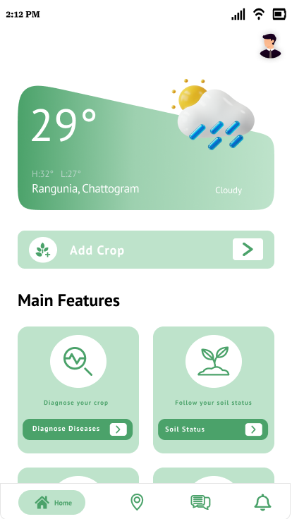
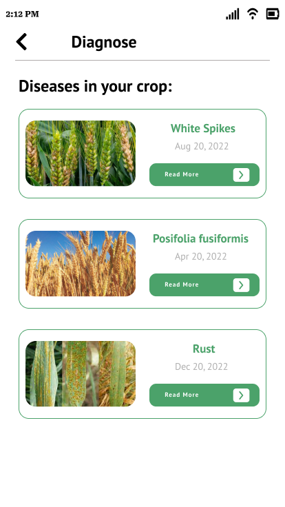
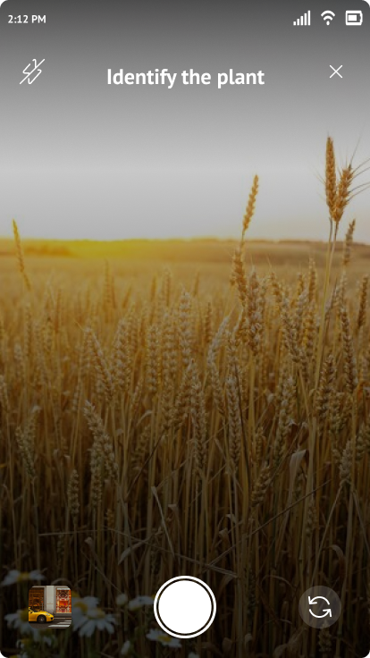

# EcoHarvest Farming

EcoHarvest Farming is an innovative concept focused on sustainable agriculture practices. The project aims to leverage technology and ecological principles to create efficient, productive, and environmentally friendly farming systems. This repository includes the user interface design and a detailed report of the project.

## Table of Contents
- [Introduction](#introduction)
- [Project Overview](#project-overview)
- [UI Design](#ui-design)
- [Image Gallery](#image-gallery)
- [Report](#report)
- [Demo Video](#demo-video)
- [Documentation](#documentation)
- [Prototyping](#prototyping)
- [Contact](#contact)

## Introduction

EcoHarvest Farming integrates modern technology with traditional farming methods to enhance crop yield, reduce resource consumption, and minimize environmental impact. This repository contains the initial design of the user interface and a comprehensive report detailing the project's vision, objectives, and proposed functionalities.

## Project Overview

EcoHarvest Farming aims to provide:
- **IoT Monitoring**: Conceptualized real-time data collection from soil moisture sensors, temperature, humidity, and other environmental parameters.
- **Automated Irrigation**: Proposed intelligent irrigation system that adjusts water supply based on soil moisture levels.
- **Data Analytics**: Planned advanced data analytics to provide insights and recommendations for optimizing farming practices.
- **Sustainable Practices**: Focus on reducing chemical use, conserving water, and maintaining soil health.

## UI Design

The UI design provides an intuitive and user-friendly interface for farmers and stakeholders to interact with the EcoHarvest Farming system. The design includes:
- **Dashboard**: Visual representation of data and analytics.
- **Sensor Monitoring**: Interface to view real-time data from IoT sensors.
- **Irrigation Control**: Control panel for automated irrigation systems.
- **Reports and Insights**: Section to view detailed reports and recommendations.

Figma Link: https://www.figma.com/design/3tLf3xlbArD0FXFTssJLEH/Collage_project_01?node-id=0-1&t=QMUTnWcQjMF9YVtS-0

# Image Gallery

## Splash Screen

## Onboarding Screens

## Sign Up

## Log In

## Home Page

## Irrigation Control

## Soil Status

## Diagnose

## Scan

## Scan Free

## Report

The report provides a detailed overview of the EcoHarvest Farming project, including:
- Project objectives
- Proposed system architecture
- Detailed description of functionalities
- Potential benefits and impact
- Future development plans

## Demo Video

Watch our demo video to see EcoHarvest Farming in action:

  
# Documentation

The full report is available on Google Docs: [EcoHarvest Farming Report](https://docs.google.com/document/d/1B6Ge0sEQKQ7JgH7oRln_49Ux5KWM3S7mWLjpsfN9UB0/edit).

Summary of the project: [EcoHarvest Project Summary](https://docs.google.com/document/d/1_t0m4mtW7u8PGohwNSuIj9B26pXwm7HH2A69o-APxhk/edit#heading=h.6jynaot9cbnq)

# Prototyping
[Click -> Figma](https://www.figma.com/proto/3tLf3xlbArD0FXFTssJLEH/Collage_project_01?node-id=1-707&t=QMUTnWcQjMF9YVtS-0&scaling=scale-down&content-scaling=fixed&page-id=0%3A1)

# Content Me
Author: Abu Bakar Istiak
E-mail -> abubakar119147@gmail.com

